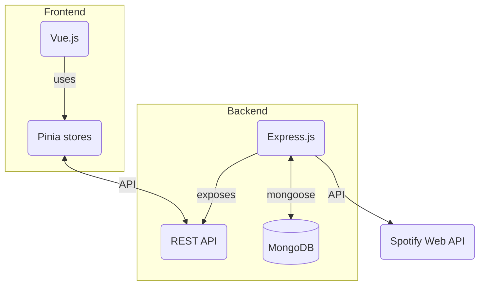
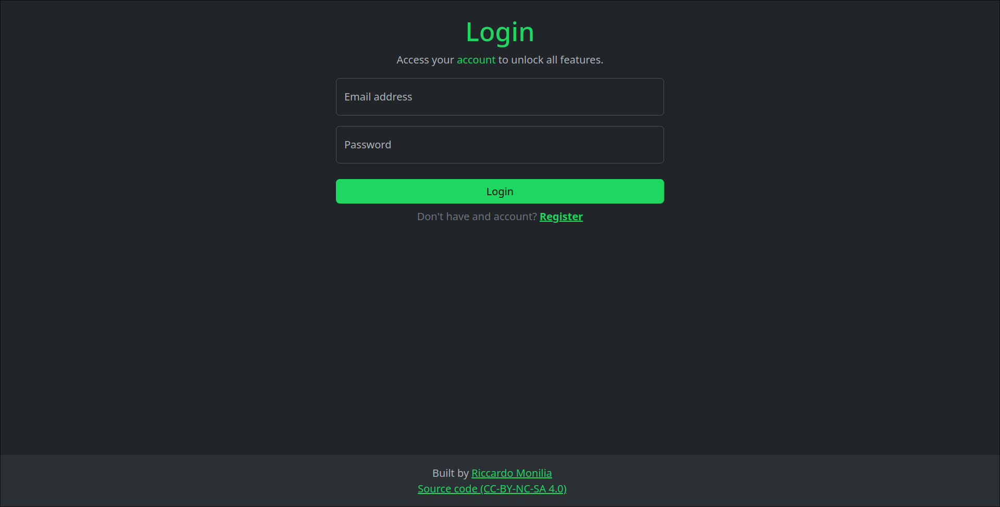
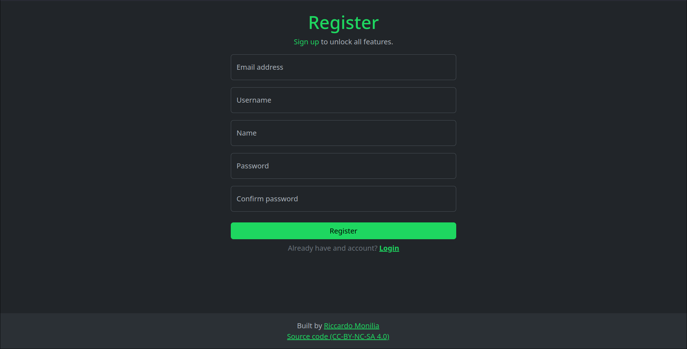
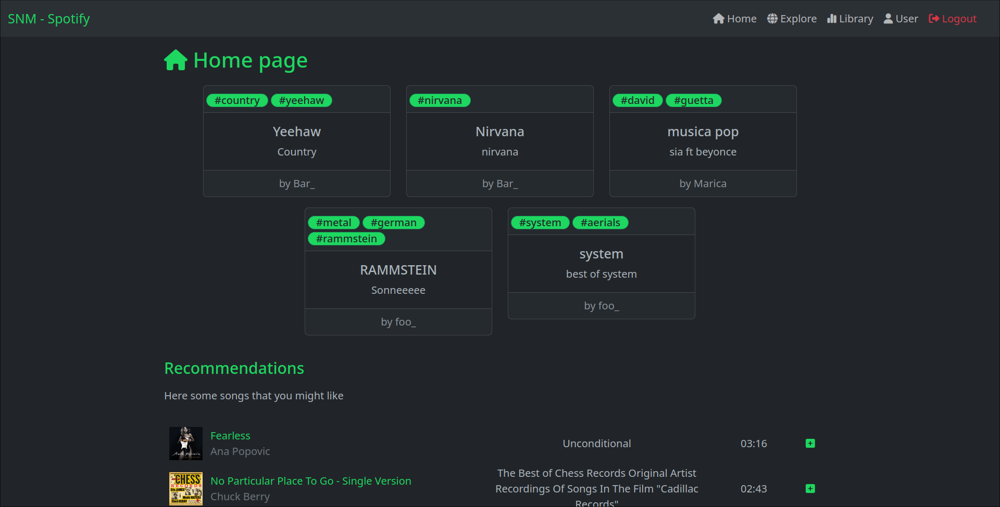
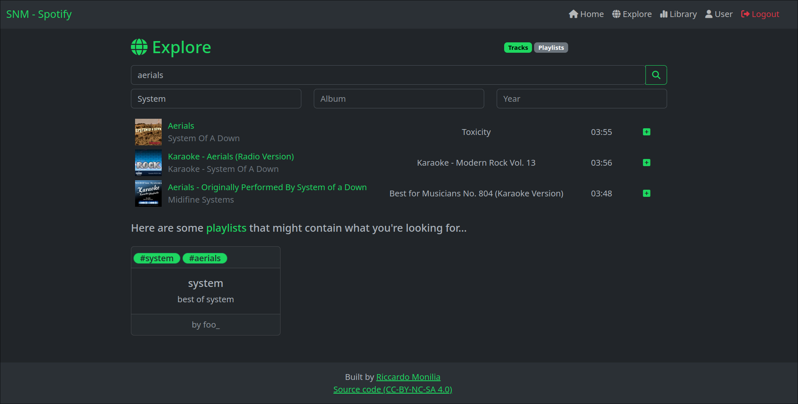
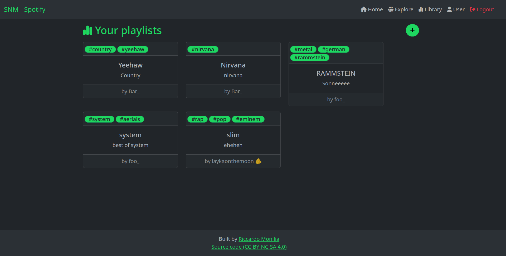
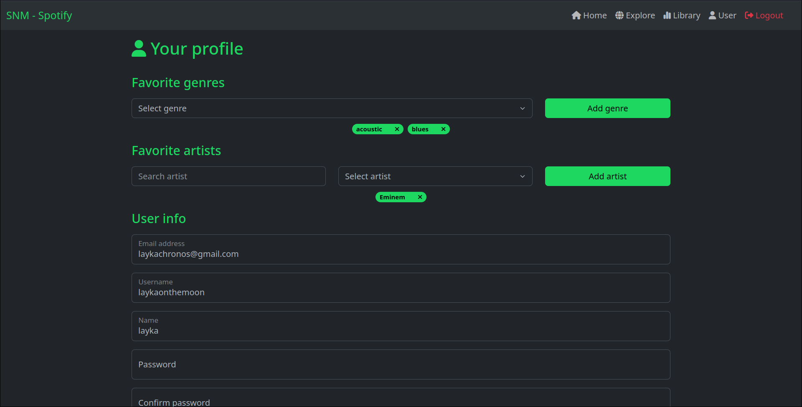
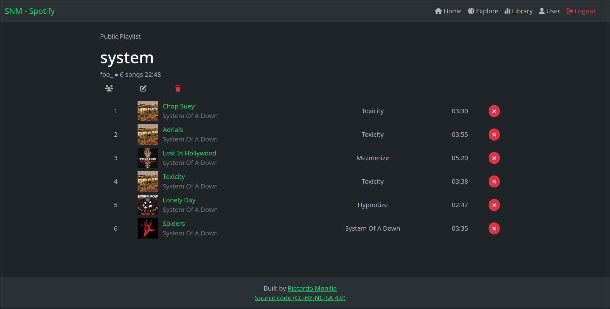
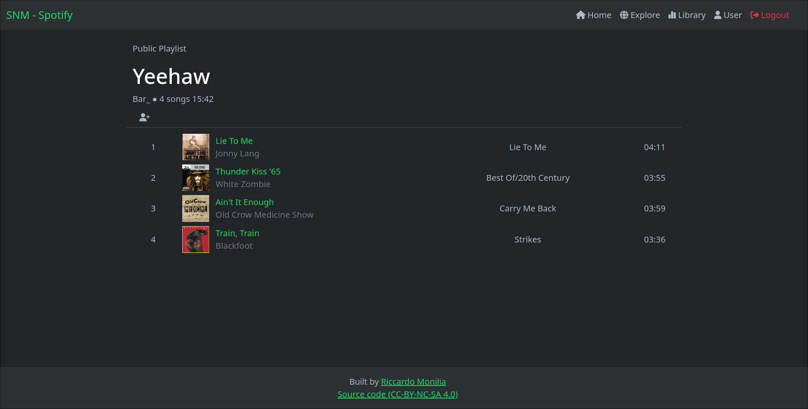
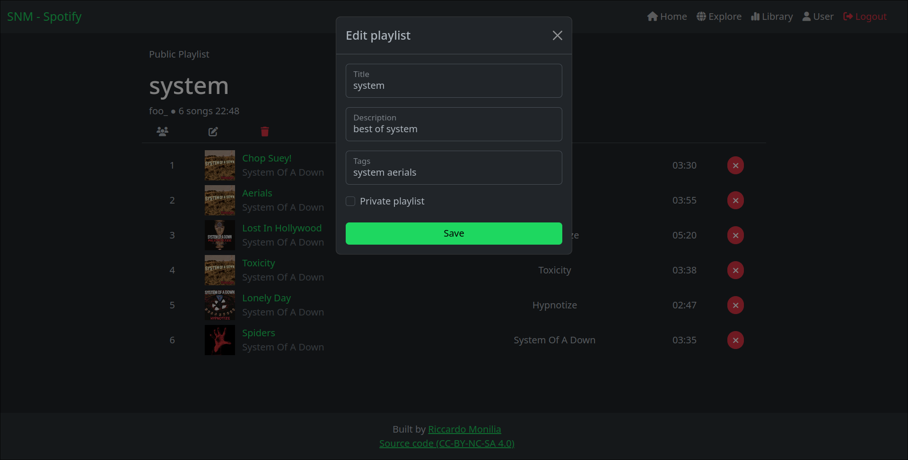

# Relazione

Relazione del progetto *"Social Network for Music (SNM)"* per il corso di [*Programmazione e linguaggi per il web*](https://www.unimi.it/it/corsi/insegnamenti-dei-corsi-di-laurea/2022/programmazione-web-e-mobile) (A.A 2022-2023). Realizzata da Monilia Riccardo (981730).

- [Relazione](#relazione)
  - [Obiettivo](#obiettivo)
  - [Installazione](#installazione)
  - [Struttura del progetto](#struttura-del-progetto)
    - [Stack tecnologico](#stack-tecnologico)
    - [Organizzazione codice](#organizzazione-codice)
      - [Backend](#backend)
      - [Frontend](#frontend)
      - [Overview](#overview)
  - [Scelte implementative](#scelte-implementative)
    - [Autenticazione e autorizzazione](#autenticazione-e-autorizzazione)
      - [Accesso endpoint protetti](#accesso-endpoint-protetti)
      - [Accesso alle pagine web protette](#accesso-alle-pagine-web-protette)
    - [Comunicazione e gestione token Spotify](#comunicazione-e-gestione-token-spotify)
      - [Gestione dei generi](#gestione-dei-generi)
    - [Validazione dei campi](#validazione-dei-campi)
    - [Swagger](#swagger)
    - [Caching delle canzoni](#caching-delle-canzoni)
  - [Showcase](#showcase)

## Obiettivo

Il presente progetto si propone di sviluppare un'applicazione web completa, comprensiva di *frontend* e *backend*, che si concentra sulla gestione e la condivisione di playlist musicali.

Gli obiettivi specifici comprendono:

1. **Gesione degli utenti**: creazione, visualizzazione, modifica, eliminazione;
2. **Gestione delle playlist**: creazione, visualizzazione, modifica, **condivisione**, eliminazione;
3. **Integrazione con l'API di Spotify**: utilizzare l'API di Spotify per ottenere informazioni sui brani, sugli artisti e sui generi. Consentire agli utenti di importare brani da Spotify nelle proprie playlist dell'applicazione *SNM*.


## Installazione

- `/backend`

  - Creare o modificare il file `.env` popolando le variabili d'ambiente:

    - `DB_URL`: url del server MongoDB
      - Esempio: `mongodb://localhost/snm`
    - `PORT`: porta su cui esporre il server
      - Esempio: `8080`
    - `SECRET`: stringa utilizzare nella funzione di hash della password
      - Esempio: `PROGETTO-DI-PWM`
    - `CLIENT_ID`: id che identifica il client, utilizzato per l'autenticazione dell'API di Spotify
      - Esempio: `123456789qwertyuiopasdfghjklzxcv`
    - `CLIENT_SECRET`: segreto del client, utilizzato per l'autenticazione dell'API di Spotify
      - Esempio:  `123456789qwertyuiopasdfghjklzxcv`

  - Installare le dipendenze tramite il comando:

    ```bash
    $ npm install
    ```

  - Avviare il server tramite il comando:

    ```bash
    $ npm run dev
    ```

  - Recarsi all'indirizzo `http://localhost:<PORT>`

- `/frontend`

  - Installare le dipendenze tramite il comando:

    ```bash
    $ npm install
    ```

  - Avviare l'applicazione tramite il comando:

    ```bash
    $ npm run dev
    ```

  - Recarsi all'indirizzo `http://localhost:5173`


## Struttura del progetto

Il progetto è stato suddiviso in una parte frontend e una parte backend, che operano in modo completamente indipendente. Ciascuna di queste parti è stata organizzata all'interno di una propria cartella, denominata rispettivamente `/frontend` e `/backend`.

### Stack tecnologico

**Backend** (in `TypeScript`)

- Gestione delle richieste REST:`express`
- Comunicazione con il database: `mongoose`
- Swagger UI: `swagger-ui-express`
- Validazione campi: `zod`

**Frontend** (in `TypeScript`)

- Framework: `VueJs`
- Styling delle pagine: `bootstrap`
- Richieste HTTP: `axios`
- Validazione campi: `zod`

**Database**

- `MongoDB`


### Organizzazione codice

#### Backend

L'infrastruttura di backend è stata realizzata tramite Express.js, fornendo un'API RESTful per la gestione delle richieste e delle risposte nell'applicazione web. Al fine di utilizzare TypeScritpt per lo sviluppo, è stato necessario adottare un runtime differente da Node.js, pertanto è stato impiegato `ts-node`, che consente di eseguire direttamente TypeScript su Node.js senza bisogno di precompilazione.

Per semplificare il processo di sviluppo e migliorare l'efficienza, è stato implementato `nodemon`, che offre la funzionalità di *hot-reload*, consentendo il ricaricamento automatico dell'applicazione in fase di sviluppo senza bisogno di riavviare manualmente il server.

Struttura cartelle (in `src/`):

- `controllers`: funzioni cruciali nella gestione delle richieste attraverso l'API REST, contengono la logica necessaria per elaborare e rispondere alle richieste in modo appropriato;
- `db`: contiene le definizioni e le configurazioni necessarie per stabilire la connessione con il database, consentendo il salvataggio e il recupero dei dati da e verso l'applicazione;
- `middlewares`: funzioni intermedie che vengono eseguite prima di gestire le richieste principali, svolgendo compiti come l'autenticazione degli utenti;
- `router`: contiene le definizioni dei vari endpoint;
- `utils`: contiene diverse utilità, come la definizione dei regex e funzioni di hash;
- `validator`: contiene le utilità per validare gli oggetti attraverso `zod`.

Viene inoltre esposto uno *swagger* all'indirizzo `<host>/api/docs`.

#### Frontend

La parte di frontend è stata implementata attraverso il framework Vue.js. L'adozione del client routing fornito da Vue.js ha consentito la creazione di un'applicazione di tipo *single page*, dove la navigazione avviene senza la necessità di ricaricare l'intera pagina. 

Il frontend è stato reso responsive attraverso l'utilizzo di Bootstrap e dei suoi componenti, assicurando che l'interfaccia si adatti in modo ottimale a diverse dimensioni di schermo e dispositivi.

Per quanto riguarda l'interazione con l'API, è stata adottata un'organizzazione centralizzata. Le richieste all'API sono gestite attraverso funzioni specifiche presenti nello store dell'applicazione (`Pinia`). Questo approccio consente di mantenere un'astrazione coesa tra il frontend e l'API sottostante, semplificando l'accesso ai dati e mantenendo un alto grado di modularità nel codice.

Struttura cartelle (in `src/`):

- `assets`: contiene risorse statiche come immagini, icone, font e altri elementi multimediali utilizzati nell'interfaccia dell'applicazione;
- `components`: contiene i componenti riutilizzabili dell'interfaccia utente;
- `pages`: contiene le pagine principali dell'applicazione, ognuna rappresentando una vista distinta dell'interfaccia utente, organizzate in modo da agevolare la navigazione e la gestione del routing;
- `stores`: contiene lo stato globale dell'applicazione e le funzioni di gestione dello stato, consentendo una gestione centralizzata e coesa dei dati condivisi tra diversi componenti;
- `types`: contiene le definizioni dei tipi globali di TypeScript;
- `utils`: contiene diverse utilità.

#### Overview



## Scelte implementative

A seguire alcune scelete implementative significative.

### Autenticazione e autorizzazione

Nel contesto dell'applicazione, il meccanismo di autenticazione e autorizzazione è strutturato attorno all'uso di un *token*, che viene trasmesso attraverso gli headers delle richieste.

Durante la fase di registrazione di un nuovo utente, un "*salt*" viene generato in modo univoco e salvato nel database. Successivamente, la password dell'utente viene sottoposta a un processo di hash utilizzando il "*salt*" generato e una frase segreta aggiuntiva. Questa procedura incrementa la sicurezza crittografica. 

```typescript
export const randomSalt = () => crypto.randomBytes(128).toString("base64");
export const hashPwd = (salt: string, pwd: string) => {
  return crypto
    .createHmac("sha256", [salt, pwd].join("/"))
    .update(config.HASH_SECRET)
    .digest("hex");
};
```

Si può illustrare questa situazione attraverso un esempio pratico: considerando la password "`qwerty1234#`" e due *salt* differenti, il processo di hash produrrà risultati differenti:

- utente Foo: `b996350795a5ceb13cdd64033bfea805fb70ab30b94d0e6c2fcfec69d89bcb00`
- utente Barr: `29c1f09c396c62e1759a73d5331723c5c72df4ce93c7e56ef449afb94403af17`


Nel processo di login, le credenziali dell'utente, come l'email e la password, vengono verificate. Se la password, sottoposta nuovamente ad hash, corrisponde ai dati memorizzati, un *token* viene creato utilizzando un ulteriore "*salt*" e l'ID dell'utente, contribuendo a rafforzare la sicurezza e l'identificazione dell'utente autenticato. In seguito, il client assumerà la responsabilità di conservare il *token* all'interno dello store dell'applicazione. 

```typescript
...
const salt = randomSalt();
user.auth.sessionToken = hashPwd(salt, user._id.toString());
await user.save();

res.setHeader("SNM-AUTH", user.auth.sessionToken);

return res.status(200).json(user).end();
...
```


#### Accesso endpoint protetti

Nel contesto delle interazioni con l'API, gran parte degli endpoint è soggetta a una protezione tramite autenticazione, il cui controllo è affidato al middleware denominato `isAuthenticated`. Questo middleware si incarica di verificare la presenza del token nell'header della richiesta (`SNM-AUTH`) e di effettuare la validazione dell'utente associato al token stesso.

```typescript
export const isAuthenticated = async (
  req: express.Request,
  res: express.Response,
  next: express.NextFunction
) => {
  try {
    const sessionToken = req.header("SNM-AUTH");

    if (!sessionToken) {
      return res.status(403).json({ message: "Unauthorized" });
    }

    const existingUser = await getUserBySessionToken(sessionToken);
    if (!existingUser) {
      return res.status(403).json({ message: "Session expired" });
    }

    req.identity = existingUser;
    next();
  } catch (error: any) {
    console.log(error);
    return res.status(500).json({ message: error.message });
  }
};
```

Oltre all'autenticazione, molti degli endpoint richiedono un ulteriore livello di controllo, in particolare per dichiarare la "possessione" di una risorsa o per ottenere l'autorizzazione alla modifica di una risorsa specifica. Questi aspetti vengono gestiti attraverso endpoint appositi. Questo processo di gestione delle autorizzazioni si basa su un sistema di verifica che valuta il legame tra l'utente e la risorsa in questione, garantendo che solo gli utenti autorizzati possano accedere e operare su determinate risorse.

```typescript
export const isPlaylistAuthor = async (
  req: express.Request,
  res: express.Response,
  next: express.NextFunction
) => {
  try {
    const { id } = req.params;
    const userId = req.identity._id;

    if (!id) {
      return res.status(400).json({ message: "Playlist id is required" });
    }

    const playlist = await getPlaylistById(id);
    if (!playlist) {
      return res.status(404).json({ message: "Playlist not found" });
    }

    if (playlist.author.toString() !== userId.toString()) {
      return res.status(403).json({
        message: "You are not the author of the playlist",
      });
    }

    req.playlist = playlist;
    next();
  } catch (error: any) {
    console.log(error);
    return res.status(500).json({ message: error.message });
  }
};
```

Di seguito un esempio di endpoint non protetto e protetto:

- Non protetto:

  ```typescript
  authRouter.post("/auth/register", register);
  ```

- Protetto:

  ```typescript
  playlistRouter.patch(
    "/playlists/:id",
    isAuthenticated,
    isPlaylistAuthor,
    editPlaylist
  );
  ```


#### Accesso alle pagine web protette

All'interno dell'applicazione, si è stabilito che le pagine accessibili senza la necessità di autenticazione siano esclusivamente quelle relative alla registrazione e al login. Per tutte le altre pagine che richiedono un livello di autenticazione, è stato implementato un meccanismo di controllo preventivo. Prima di consentire qualsiasi navigazione a tali pagine, si verifica la validità del *token* dell'utente, qualora presente. Questa verifica viene eseguita utilizzando l'endpoint denominato `api/auth/verify`. In tal modo, si garantisce che solamente gli utenti con *token* validi abbiano l'autorizzazione a accedere alle pagine riservate.

```typescript
// Router
router.beforeEach(async (to, _from) => {
  const nextPage = getByRoute(to);

  if (nextPage?.meta?.requiresAuth) {
    const $user = useUserStore();
    const isValid = await $user.verify();
    if (!isValid) {
      router.push({ name: "login" });
    }
  }
});
```

```typescript
// User Store
...
async verify(): Promise<boolean> {
      if (!this.token) return false;

      try {
        const res = await axios.get("/auth/verify", {
          headers: {
            "SNM-AUTH": this.token,
          },
        });
		...
}
...
```


### Comunicazione e gestione token Spotify

Per stabilire la comunicazione con Spotify, è stato adottato il meccanismo denominato "[Client Credentials Flow](https://developer.spotify.com/documentation/web-api/tutorials/client-credentials-flow)." Questo flusso è utilizzato per l'autenticazione tra server e server, come dichiarato nella documentazione di Spotify. Di conseguenza, le credenziali riservate come `client_id` e `client_secret` sono conservate nel backend dell'applicazione, mantenendole protette e lontane dalla visibilità esterna.

Nel contesto di questa applicazione, il backend si occupa di ottenere e utilizzare il *token* di accesso da Spotify, fornendo all'applicazione una modalità sicura e affidabile per interagire con i dati e i servizi di Spotify.

La gestione del token avviene attraverso il seguente processo:

1. Gli endpoint che interagiscono con Spotify richiedono il token di accesso mediante l'utilizzo della funzione `getSpotifyToken`.
2. La funzione `getSpotifyToken` verifica inizialmente se il token è già presente. Se è presente, il token viene restituito direttamente.
3. Nel caso in cui il token non sia presente, la funzione `getSpotifyToken` avvia una richiesta di fetch per ottenere il token di accesso da Spotify.
4. Al fine di ottimizzare l'utilizzo del token, viene impostato un timer. Questo timer è programmato per eliminare il token due minuti prima della sua scadenza. Ciò permette di assicurare che l'accesso alle risorse di Spotify sia continuo e non venga interrotto a causa della scadenza del token.

```typescript
let access_token: string | undefined;
let expires_in = 3480; // 1h - 2m

export const getSpotifyToken = async () => {
  if (!access_token) {
    const { access_token: token } = await fetchSpotifyToken();
    access_token = token;

    setTimeout(clearToken, expires_in * 1000);
  }
  return access_token;
};
```


#### Gestione dei generi

L'ottenimento dei generi musicali disponibili è stato un processo semplice, il che ha agevolato l'implementazione di una funzionalità che consente agli utenti di selezionare i propri generi musicali preferiti. 

Tuttavia, l'ottenimento dei generi musicali specifici di singole canzoni e artisti è risultato praticamente impossible. Anche se la documentazione dell'API di Spotify forniva indicazioni in merito, la reale implementazione di questo processo non forniva le informazioni indicate. Di conseguenza, non è stato possibile realizzare le raccomandazioni delle playlist in base ai generi delle canzoni contenute al suo interno.


### Validazione dei campi

In entrambi il backend e il frontend, è stata adottata la libreria "zod" per effettuare la validazione dei campi. Tuttavia, sono state adottate alcune differenze nella definizione degli oggetti all'interno delle rispettive parti dell'applicazione, al fine di conseguire risultati specifici.

Nel frontend, le definizioni degli oggetti sono state rese più specifiche per fornire una sensazione di maggiore responsività. Ad esempio, per la validazione delle password, è stata implementata una definizione più dettagliata che richiede che le password siano lunghe da 8 a 40 caratteri e contengano almeno una lettera, un numero e un carattere speciale.

Esempio dello schema della password nel frontend:

````typescript
const passwordSchema = z
  .string()
  .min(8, { message: "Password must be at least 8 characters long" })
  .max(40, { message: "Password must be less than 40 characters long" })
  .regex(/^(?=.*[A-Za-z])(?=.*\d)(?=.*[@$!%*#?&^])[A-Za-z\d@$!%*#?&^]{8,40}$/, {
    message:
      "Password must contain at least one letter, number, and special character",
  });
````

 Nel backend, la definizione degli oggetti ha un focus più specifico sulla conformità a determinate regole predefinite. Ad esempio, nello schema della password nel backend, la validazione avviene mediante l'uso di una regex predefinita e un messaggio associato.

Esempio dello schema della password nel backend:

```typescript
const password = /^(?=.*[A-Za-z])(?=.*\d)(?=.*[@$!%*#?&^])[A-Za-z\d@$!%*#?&^]{8,40}$/;
const passwordDescr = "8-40 characters, at least one uppercase, one lowercase, one number and one special character (e.g. @$!%*#?&^)";

const registerUserSchema = z.object({
  ...
  password: z.string().regex(regex.password, { message: regex.passwordDescr }),
});
```


### Swagger

L'interfaccia Swagger è stata realizzata utilizzando la libreria `swagger-ui-express`. Per quanto riguarda la definizione iniziale della specifica, ci si è avvalsi di `swagger-autogen`, un'opzione che ha consentito di automatizzare il processo di riconoscimento degli endpoint dell'applicazione.

Nonostante il vantaggio dell'automazione, è emerso che alcuni endpoint non potevano essere completamente definiti. Questa limitazione ha impedito la piena e accurata definizione delle informazioni riguardanti tali endpoint.

Una possibile ipotesi avanzata è che il problema potesse essere legato all'ambiente di runtime "`ts-node`", ma questa congettura non è stata confermata e rappresenta solamente una supposizione senza certezze.

Di conseguenza, per risolvere la situazione e garantire una documentazione esaustiva, è stato necessario procedere con la creazione manuale della specifica mancante per gli endpoint coinvolti.


### Caching delle canzoni

Considerando l'importanza cruciale della gestione dei dati delle canzoni e la frequenza elevata dei download associati, è stata introdotta un'implementazione di caching relativamente semplice.

La logica del caching si basa su un'approccio che considera l'immutabilità dei dati delle canzoni nel breve periodo. In pratica, è stato sviluppato un meccanismo che sfrutta una *hashmap* conservata nello store locale. Questa hashmap memorizza gli ID delle canzoni che sono state precedentemente scaricate e salvate nella cache.

Quando viene fornito un ID di una canzone, l'applicazione esegue una verifica nella hashmap locale. Se l'ID è presente, ciò indica che la canzone è già presente nella cache. In questo caso, l'applicazione è in grado di restituire direttamente i dati dalla cache, evitando così un ulteriore download da parte dell'API di Spotify. Al contrario, se l'ID non è presente nella hashmap, l'applicazione procede con il download dei dati della canzone attraverso l'API di Spotify.

Attraverso questo semplice meccanismo di caching, è stato possibile ottimizzare l'efficienza nell'accesso ai dati delle canzoni, evitando download ridondanti e ottimizzando le performance dell'applicazione nell'ambito della gestione delle risorse musicali.

```typescript
// Playlist store
...
    _checkCachedTracks(trackIds: { ids: string[] }): TrackData[] {
      let tracks: TrackData[] = [];

      if (store.has("tracks")) {
        const cachedTracks = store.get("tracks") as TrackCache;

        if (Object.keys(cachedTracks).length === 0) {
          return [];
        }

        for (let i = 0; i < trackIds.ids.length; i++) {
          const track = cachedTracks[trackIds.ids[i]];
          if (track !== undefined) {
            tracks.push(track);
            trackIds.ids.splice(i, 1);
          }
        }
      }
      return tracks;
    },
    _cacheTrack(track: TrackData): void {
      if (store.has("tracks")) {
        const cachedTracks = store.get("tracks") as TrackCache;
        cachedTracks[track.id] = track;
        store.set("tracks", cachedTracks);
      } else {
        const cachedTracks = {} as TrackCache;
        cachedTracks[track.id] = track;
        store.set("tracks", cachedTracks);
      }
    },
...
```


## Showcase

- Login, pagina per effettuare il login
  
- Register, pagina per effettuare la registrazione
  
- Home page, pagina principale in cui vi sono le playlist pubbliche e le canzoni raccomandate
  

- Explore, pagina per la ricerca di canzoni e playlist
  

- Library, pagina contenente le proprie playlist e quelle seguite
  

- User, pagina contenente le informazioni utente, le funzionalità di aggiunta preferiti e modifica dei dati
  

- Playlist dashboard, pagina contenente una playlist di propria creazione
   

- Playlist dashboard, pagina contenente una playlist di un altro utente
  

- Edit playlist, form per la modifica di una propria playlist
  
