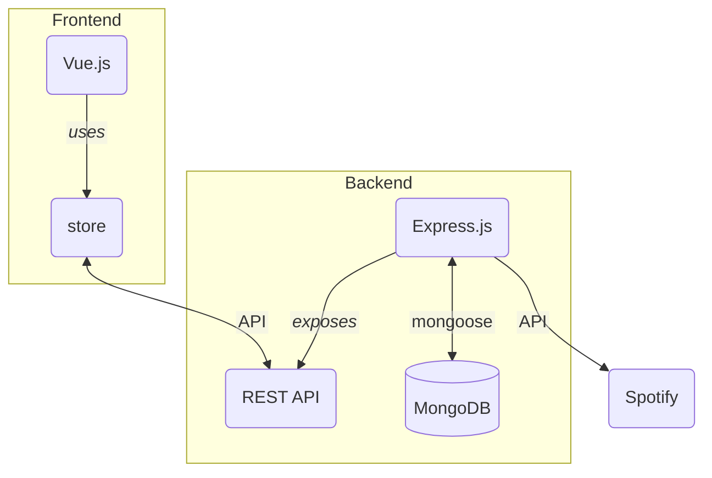

# Relazione

Relazione del progetto *"Social Network for Music (SNM)"* per il corso di [*Programmazione e linguaggi per il web*](https://www.unimi.it/it/corsi/insegnamenti-dei-corsi-di-laurea/2022/programmazione-web-e-mobile) (A.A 2022-2023). Realizzata da Monilia Riccardo (981730).

## Obiettivo

Il presente progetto si propone di sviluppare un'applicazione web completa, comprensiva di *frontend* e *backend*, che si concentra sulla gestione e la condivisione di playlist musicali.

Gli obiettivi specifici comprendono:

1. **Gesione degli utenti**: creazione, visualizzazione, modifica, eliminazione;
2. **Gestione delle playlist**: creazione, visualizzazione, modifica, **condivisione**, eliminazione;
3. **Integrazione con l'API di Spotify**: utilizzare l'API di Spotify per ottenere informazioni sui brani, sugli artisti e sui generi. Consentire agli utenti di importare brani da Spotify nelle proprie playlist dell'applicazione *SNM*.

## Struttura del progetto

Il progetto è stato suddiviso in una parte frontend e una parte backend, che operano in modo completamente indipendente. Ciascuna di queste parti è stata organizzata all'interno di una propria cartella, denominata rispettivamente `/frontend` e `/backend`.

### Stack tecnologico

**Backend** (in `TypeScript`)

- Gestione delle richieste REST:`express`
- Comunicazione con il database: `mongoose`
- Swagger UI: `swagger-ui-express`
- Validazione campi: `zod`

**Frontend** (in `TypeScript`)

- Framework: `VueJs`
- Styling delle pagine: `bootstrap`
- Richieste HTTP: `axios`
- Validazione campi: `zod`

**Database**

- `MongoDB`

### Organizzazione codice

#### Backend

L'infrastruttura di backend è stata realizzata tramite Express.js, fornendo un'API RESTful per la gestione delle richieste e delle risposte nell'applicazione web. Al fine di utilizzare TypeScritpt per lo sviluppo, è stato necessario adottare un runtime differente da Node.js, pertanto è stato impiegato `ts-node`, che consente di eseguire direttamente TypeScript su Node.js senza bisogno di precompilazione.

Per semplificare il processo di sviluppo e migliorare l'efficienza, è stato implementato `nodemon`, che offre la funzionalità di *hot-reload*, consentendo il ricaricamento automatico dell'applicazione in fase di sviluppo senza bisogno di riavviare manualmente il server.

Struttura cartelle (in `src/`):

- `controllers`: funzioni cruciali nella gestione delle richieste attraverso l'API REST, contengono la logica necessaria per elaborare e rispondere alle richieste in modo appropriato;
- `db`: contiene le definizioni e le configurazioni necessarie per stabilire la connessione con il database, consentendo il salvataggio e il recupero dei dati da e verso l'applicazione;
- `middlewares`: funzioni intermedie che vengono eseguite prima di gestire le richieste principali, svolgendo compiti come l'autenticazione degli utenti;
- `router`: contiene le definizioni dei vari endpoint;
- `utils`: contiene diverse utilità, come la definizione dei regex e funzioni di hash;
- `validator`: contiene le utilità per validare gli oggetti attraverso `zod`.

Viene inoltre esposto uno *swagger* all'indirizzo `<host>/api/docs`.

#### Frontend

La parte di frontend è stata implementata attraverso il framework Vue.js. L'adozione del client routing fornito da Vue.js ha consentito la creazione di un'applicazione di tipo *single page*, dove la navigazione avviene senza la necessità di ricaricare l'intera pagina. 

Il frontend è stato reso responsive attraverso l'utilizzo di Bootstrap e dei suoi componenti, assicurando che l'interfaccia si adatti in modo ottimale a diverse dimensioni di schermo e dispositivi.

Per quanto riguarda l'interazione con l'API, è stata adottata un'organizzazione centralizzata. Le richieste all'API sono gestite attraverso funzioni specifiche presenti nello store dell'applicazione (`Pinia`). Questo approccio consente di mantenere un'astrazione coesa tra il frontend e l'API sottostante, semplificando l'accesso ai dati e mantenendo un alto grado di modularità nel codice.

Struttura cartelle (in `src/`):

- `assets`: contiene risorse statiche come immagini, icone, font e altri elementi multimediali utilizzati nell'interfaccia dell'applicazione;
- `components`: contiene i componenti riutilizzabili dell'interfaccia utente;
- `pages`: contiene le pagine principali dell'applicazione, ognuna rappresentando una vista distinta dell'interfaccia utente, organizzate in modo da agevolare la navigazione e la gestione del routing;
- `stores`: contiene lo stato globale dell'applicazione e le funzioni di gestione dello stato, consentendo una gestione centralizzata e coesa dei dati condivisi tra diversi componenti;
- `types`: contiene le definizioni dei tipi globali di TypeScript;
- `utils`: contiene diverse utilità.

#### Overview

